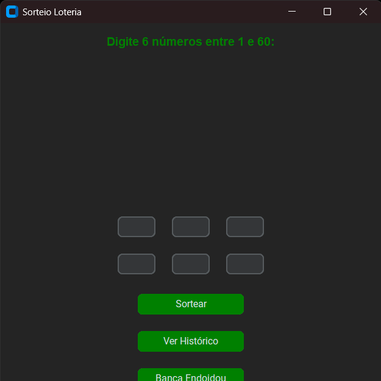
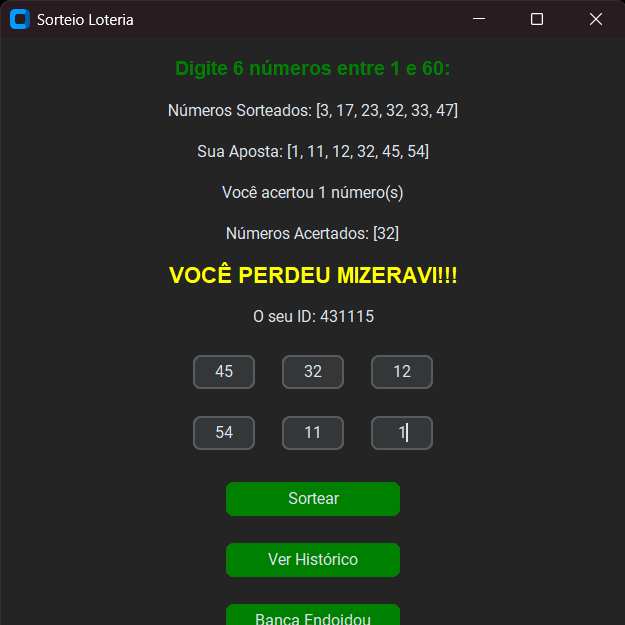

# 🎰 Sorteador Digital

Um programa de loteria em Python. O usuário insere uma sequência de números e o programa compara com uma sequência aleatória gerada automaticamente. O objetivo é verificar quantos números foram acertados.

---

## 📷 Demonstrações

<!-- Adicione aqui suas imagens, GIFs ou prints da interface do programa -->





---

## 🚀 Como executar


### Requisitos
- Python 3.0 +

### Execução
```bash
git clone https://github.com/seu-usuario/sorteador-digital.git
pip install -r requirements.txt
cd projeto-final-grupo-1-ilp
python -m utils.main

```
 
---

### 👨‍💻 Autores

- **Carlos Mateus** — Desenvolvedor backend  — [@CarlosIFRN](https://github.com/CarlosIFRN)
- **Jadson Alves** — Desenvolvedor backend  — [@JadsonAlv3s](https://github.com/JadsonAlv3s)
- **Kauã Henrique** — Desenvolvedor frontend — [@Kaua920](https://github.com/Kaua920)
- **Yuri Fábio** — Desenvolvedor backend — [@yurif4bio](https://github.com/yurif4bio)
