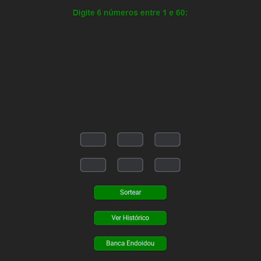
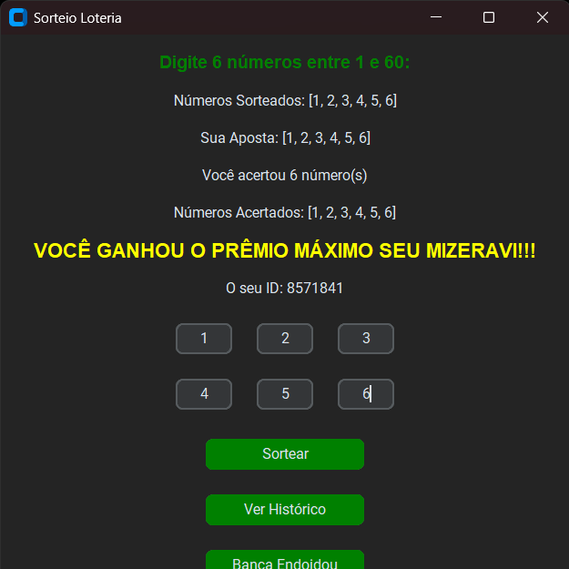
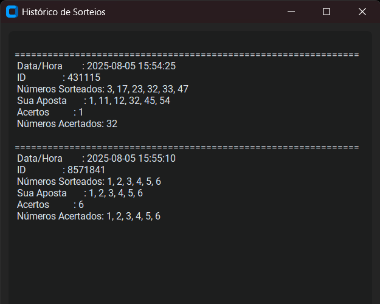

<p align="center">
  
</p>

<h2 align="center">▶️ Demonstração ao vivo</h2>

<p align="center">
  
</p>

<h1 align="center">🎰 Sorteador Digital</h1>

Um sistema interativo de sorteio de números, desenvolvido em Python com interface gráfica. O usuário insere sua própria sequência e testa a sorte contra uma sequência aleatória gerada automaticamente pelo programa.

Este projeto simula uma loteria digital de forma intuitiva e educativa, servindo tanto para fins de entretenimento quanto para o aprendizado de lógica de programação, manipulação de dados e uso de interface gráfica com `tkinter`.

---

## 🧠 Motivação

A ideia surgiu da proposta de aplicar conceitos de lógica de programação na construção de uma aplicação prática, com foco em:

- Validação de dados do usuário
- Comparação algorítmica de listas
- Geração randômica com `random`
- Histórico de apostas
- Interface visual acessível

---

## ✅ Funcionalidades

- 🔢 Entrada personalizada de números (aposta)
- 🎲 Sorteio aleatório automático
- 📊 Comparação entre aposta e sorteio
- 🧾 Exibição de resultados
- 🕓 Registro de histórico com horário e ID
- 🖼️ Interface gráfica interativa via `tkinter`

---

## 🖼️ Demonstrações

| Interface | Resultado | Histórico |
|----------|------------|------------|
|  |  |  | |

---

## ⚙️ Tecnologias utilizadas

- **Python 3.x**
- **tkinter** (GUI)
- **random** (sorteio)
- **datetime** (registro histórico)
- **OS e funções nativas** do Python

---

## 🚀 Como executar

### Requisitos
- Python 3.10 ou superior instalado

### Passos:
```bash
# 1. Clone o repositório
git clone https://github.com/seu-usuario/sorteador-digital.git

# 2. Acesse a pasta do projeto
cd projeto-final-grupo-1-ilp

# 3. Instale as dependências 
pip install -r requirements.txt

# 4. Execute o programa
python main.py

```
<h2 align="center">👨‍💻 Equipe de Desenvolvimento</h2>

<div align="center">

<table>
  <tr>
    <td align="center">
      <a href="https://github.com/CarlosIFRN" target="_blank">
        <br />
        <sub><b>Carlos Mateus</b></sub><br />
        <small>Backend</small>
      </a>
    </td>
    <td align="center">
      <a href="https://github.com/JadsonAlv3s" target="_blank">
        <br />
        <sub><b>Jadson Alves</b></sub><br />
        <small>Backend</small>
      </a>
    </td>
    <td align="center">
      <a href="https://github.com/Kaua920" target="_blank">
        <br />
        <sub><b>Kauã Henrique</b></sub><br />
        <small>Frontend</small>
      </a>
    </td>
    <td align="center">
      <a href="https://github.com/yurif4bio" target="_blank">
        <br />
        <sub><b>Yuri Fábio</b></sub><br />
        <small>Backend</small>
      </a>
    </td>
  </tr>
</table>

</div>
